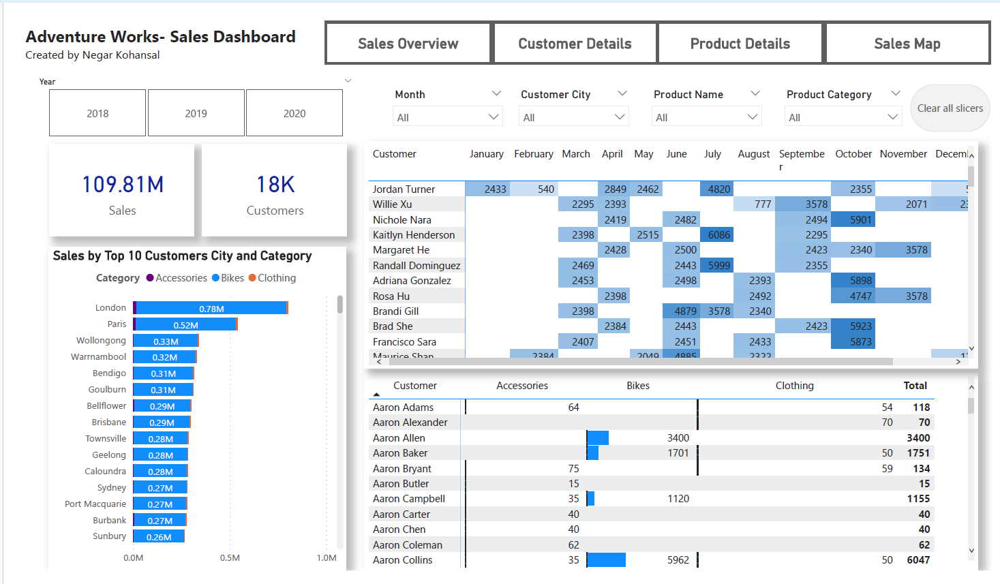
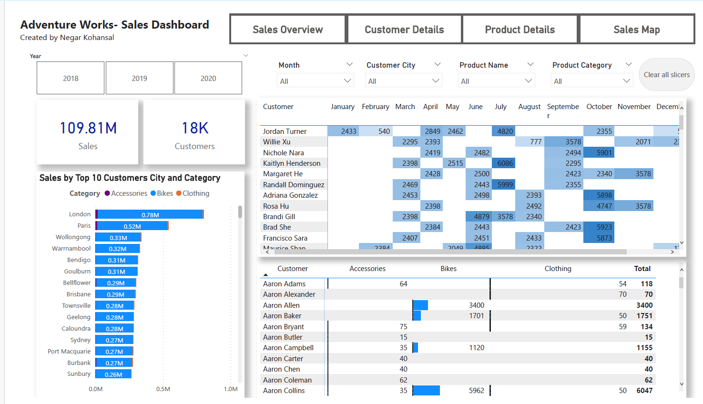
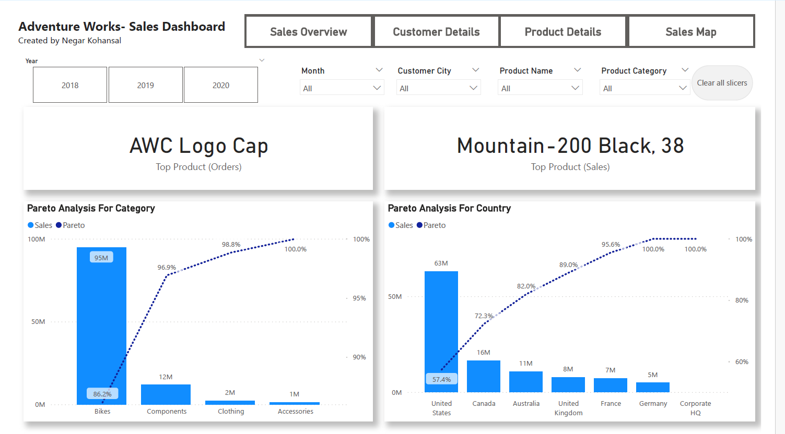
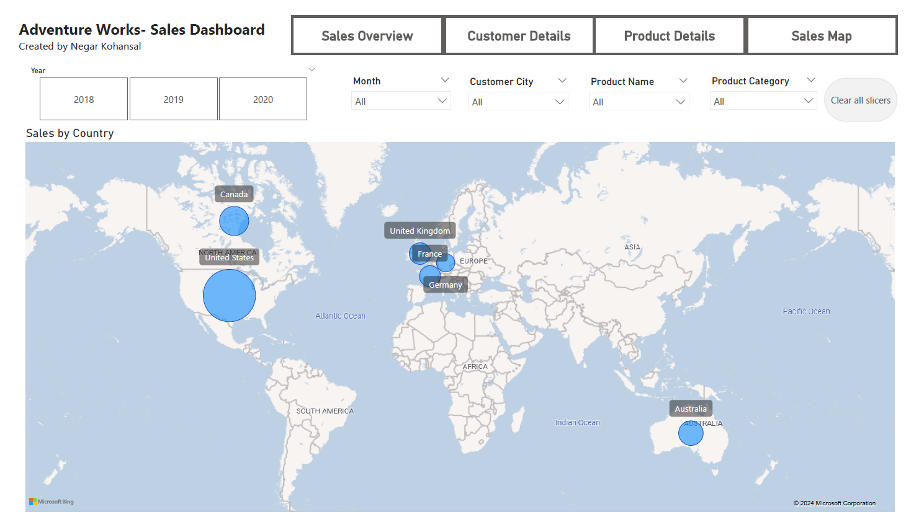

# 📊 Adventure Works Sales Dashboard

This project is an interactive sales dashboard built with **Power BI** using the **Adventure Works** dataset.  
The dashboard provides insights into customer behavior, sales performance, and product details.  

---

## ✨ Features
- Yearly analysis (2018–2020)  
- Total Sales and Customers overview  
- Top 10 customers by city and category (Accessories, Bikes, Clothing)  
- Monthly sales trend by customer  
- Detailed view of customer purchases across product categories  
- Interactive filters for Year, Month, Customer City, Product Name, and Product Category  
- Pareto Analysis for Category
- Pareto Analysis For Country
- Top Product base Order
- Top Product base Sales
- Sales by the Country on the Map
---

## 📂 Files
- `AdventureWorks Sales.xlsx` → dataset  
- `AdventureWorks.pbix` → Power BI dashboard file  
- `Dashboard1.png`, `Dashboard2.png` → dashboard preview images  

---

## 🖼️ Dashboard Preview
  
 
  
 

---

## 🚀 How to Use
1. Open the `AdventureWorks.pbix` file with Power BI Desktop.  
2. Update the data source path to `AdventureWorks Sales.xlsx` if necessary.  
3. Explore the dashboard using the interactive slicers and tabs.  

---

## 📌 Note
This project is for educational purposes only and uses demo data.  
